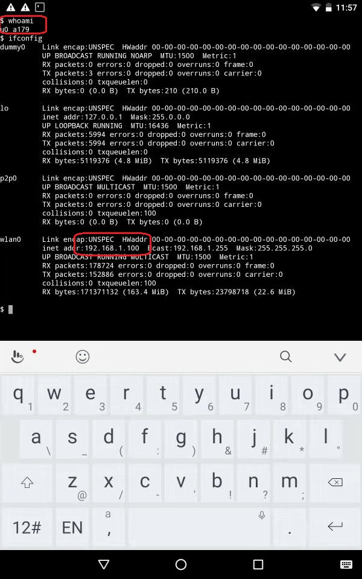
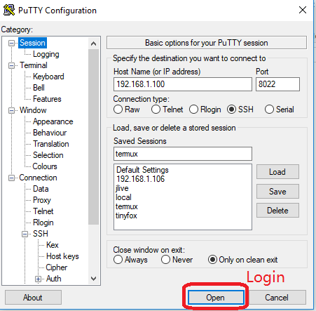

Deploy a Web App Built with Larval+Node.JS+Redis on Android Termux
---

Table of Contents

- [The Web App to deploy](#the-web-app-to-deploy)
- [Install termux.app](#install-termuxapp)
- [Install packages in termux](#install-packages-in-termux)
    - [System Info](#system-info)
    - [Utility packages](#utility-packages)
    - [SSH](#ssh)
        - [Start SSH server](#start-ssh-server)
        - [Use puttygen.exe to generate key files](#use-puttygenexe-to-generate-key-files)
        - [Add public key to `~/.ssh/autherized_keys`](#add-public-key-to-sshautherizedkeys)
        - [Use putty.exe to login](#use-puttyexe-to-login)
    - [proot](#proot)
    - [Git (optional)](#git-optional)
    - [Python (optional)](#python-optional)
    - [clang (optional)](#clang-optional)
    - [redis](#redis)
    - [node.js](#nodejs)
    - [PHP](#php)
    - [Nginx](#nginx)
    - [php-fpm](#php-fpm)
- [Configuration](#configuration)
    - [Update `/etc/nginx/nginx.conf`](#update-etcnginxnginxconf)
    - [Update `/etc/php-fpm.d/www.conf`](#update-etcphp-fpmdwwwconf)
    - [node modules](#node-modules)
    - [Laravel](#laravel)
    - [Startup script](#startup-script)
- [Visit the app](#visit-the-app)
- [references](#references)

## The Web App to deploy

The web app is built with PHP/Laravel, node.js and redis.

The code will be deployed in `$HOME/firstchart`.

https://drive.google.com/file/d/1IUFCGSBIXxbmRrx_neX9PDLcM4C_Ctak/view?usp=sharing

https://github.com/maximus1127/neweyechart

## Install termux.app

Get and install the APK from Google Play or F-Droid.

You can get the links from the website.

https://termux.com/

## Install packages in termux

After starting termux app, you can run commands in the terminal.

### System Info

```bash

whoami # the user name in use

ifconfig # find the IP address

```



### Utility packages

- Package `wget` and `curl` are used to download files from HTTP servers.

- Package `vim` is a editor.

```bash
pkg install wget curl vim
```

### SSH

```bash
pkg install sshd
```

#### Start SSH server

```bash
sshd
```

The SSH server in termux can only be logged in with a key files. Go to https://www.chiark.greenend.org.uk/~sgtatham/putty/latest.html and get putty.exe & puttygen.exe.

- putty.exe: a SSH client
- puttygen.exe: a RSA and DSA key generation utility

#### Use puttygen.exe to generate key files


#### Add public key to `~/.ssh/autherized_keys`

To move termux.pub to Android, you can host the file on a HTTP or FTP server in local network. Then download it with wget.

```bash
wget http://192.168.1.106:8000/termux.pub # Use your own address
```

Just append the content into `~/.ssh/autherized_keys`

```bash
cat termux.pub >> ~/.ssh/autherized_keys
```

#### Use putty.exe to login





### proot

```bash
pkg install proot # Nginx needs chroot to work
```

After installing proot, you can use command `termux-chroot` to enter simulated root environment.

```bash
termux-chroot
```

### Git (optional)

```bash
pkg install git # To get code from Github
```

### Python (optional)

```bash
pkg install python2 # To build code when installing node modules 
```

### clang (optional)

```bash
pkg install clang # g++ to build code
```

### redis

```bash
pkg install redis
```

### node.js

```bash
pkg install node
```

### PHP

```bash
pkg install php
```

### Nginx

```bash
pkg install nginx
```

### php-fpm

```bash
pkg install php-fpm
```

## Configuration

### Update `/etc/nginx/nginx.conf`

You can get the file from [nginx.conf](https://github.com/fox000002/blog/blob/master/termux/nginx.conf).

```bash

#user  nobody;
worker_processes  1;

#error_log  logs/error.log;
#error_log  logs/error.log  notice;
#error_log  logs/error.log  info;

#pid        logs/nginx.pid;


events {
    worker_connections  1024;
}


http {
    include       mime.types;
    default_type  application/octet-stream;

    #log_format  main  '$remote_addr - $remote_user [$time_local] "$request" '
    #                  '$status $body_bytes_sent "$http_referer" '
    #                  '"$http_user_agent" "$http_x_forwarded_for"';

    #access_log  logs/access.log  main;

    sendfile        on;
    #tcp_nopush     on;

    #keepalive_timeout  0;
    keepalive_timeout  65;

    #gzip  on;

    server {
        listen       8080;
        server_name  localhost;

        #charset koi8-r;

        #access_log  logs/host.access.log  main;

    root /data/data/com.termux/files/home/firstchart/public;
    index index.php index.html index.htm;

    location / {
        try_files $uri $uri/ /index.php?$query_string;
    }

        #error_page  404              /404.html;

        # redirect server error pages to the static page /50x.html
        #
        error_page   500 502 503 504  /50x.html;
        location = /50x.html {
            root   /data/data/com.termux/files/usr/share/nginx/html;
        }

        # proxy the PHP scripts to Apache listening on 127.0.0.1:80
        #
        #location ~ \.php$ {
        #    proxy_pass   http://127.0.0.1;
        #}

        # pass the PHP scripts to FastCGI server listening on 127.0.0.1:9000
        #
    location ~ \.php$ {
            #root           html;
            try_files $uri /index.php =404;
            fastcgi_split_path_info ^(.+\.php)(/.+)$;
            fastcgi_pass   127.0.0.1:9000;
            fastcgi_index  index.php;
            fastcgi_param  SCRIPT_FILENAME  $document_root$fastcgi_script_name;
            include        fastcgi_params;
    }

        # deny access to .htaccess files, if Apache's document root
        # concurs with nginx's one
        #
        #location ~ /\.ht {
        #    deny  all;
        #}
    }


    # another virtual host using mix of IP-, name-, and port-based configuration
    #
    #server {
    #    listen       8000;
    #    listen       somename:8080;
    #    server_name  somename  alias  another.alias;

    #    location / {
    #        root   html;
    #        index  index.html index.htm;
    #    }
    #}


    # HTTPS server
    #
    #server {
    #    listen       443 ssl;
    #    server_name  localhost;

    #    ssl_certificate      cert.pem;
    #    ssl_certificate_key  cert.key;

    #    ssl_session_cache    shared:SSL:1m;
    #    ssl_session_timeout  5m;

    #    ssl_ciphers  HIGH:!aNULL:!MD5;
    #    ssl_prefer_server_ciphers  on;

    #    location / {
    #        root   html;
    #        index  index.html index.htm;
    #    }
    #}

}

```

### Update `/etc/php-fpm.d/www.conf`

Edit the `listen` address.

```bash
listen = 127.0.0.1
```

You can also get the file from [www.conf](https://github.com/fox000002/blog/blob/master/termux/www.conf).


### node modules

After upload code in `$HOME/firstchart`, you need to install the node modules.

```bash
cd $HOME/firstchart

npm install --production

# or

NODE_ENV=production npm install
```

### Laravel

If the code does contains vendor files, install composer and packages.

- composer

```bash
php -r "copy('https://getcomposer.org/installer', 'composer-setup.php');"
php -r "if (hash_file('sha384', 'composer-setup.php') === '93b54496392c062774670ac18b134c3b3a95e5a5e5c8f1a9f115f203b75bf9a129d5daa8ba6a13e2cc8a1da0806388a8') { echo 'Installer verified'; } else { echo 'Installer corrupt'; unlink('composer-setup.php'); } echo PHP_EOL;"
php composer-setup.php
php -r "unlink('composer-setup.php');"
```

- packages

```bash
php composer.phar install
```

### Startup script

Edit `~/.bashrc`. You can also get it from [.bashrc](https://github.com/fox000002/blog/blob/master/termux/.bashrc)

```bash
# bootstrap
if [ "XXX$HOME" = "XXX/home" ]
then
  uname -a

  # redis
  pgrep redis-server || (redis-server &)

  # node
  cd /home/firstchart
  pgrep node || (node server.js &)
  cd /home

  # php-fpm
  pgrep php-fpm || php-fpm

  # NGINX
  pgrep nginx || nginx
else
  # chroot if not in root environment
  termux-chroot
fi
```

After updating `.bashrc`, make it in effect.

```bash
source ~/.bashrc
```

## Visit the app


## references

[1] https://getcomposer.org/download/

[2] https://www.sitepoint.com/android-elephpant-laravel-android-phone/
