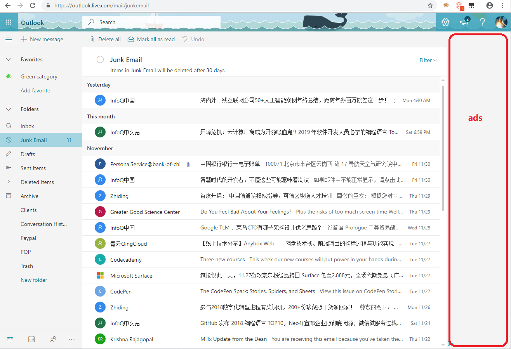

The class and id are dynamic on https://outlook.live.com/mail. To hide the ads, it has to locate that by index. 



```JavaScript
// ==UserScript==
// @name         outlook
// @namespace    http://tampermonkey.net/
// @version      0.1
// @description  try to take over the world!
// @author       You
// @match        https://outlook.live.com/mail/*
// @grant        none
// @require https://code.jquery.com/jquery-1.12.4.min.js
// ==/UserScript==
(function() {
  'use strict';
  $(function() {
   var timer = setInterval(function() {
     $('div#app > div > div:nth-child(2) > div > div > div:nth-child(4)').hide();
     if ($('div#app > div > div:nth-child(2) > div > div > div:nth-child(4)').css('display') === 'none') {
         console.log('Hide side ads');
       clearInterval(timer);
     }
   }, 100);

   var timer2 = setInterval(function() {
     if ($('div#app > div > div:nth-child(2) > div > div > div:nth-child(4)').css('display') === 'none') {
       $('#app > div > div:nth-child(2) > div > div:nth-child(1) > div:nth-child(1) > div:nth-child(2) > div > div:nth-child(2)').hide();
       if ($('#app > div > div:nth-child(2) > div > div:nth-child(1) > div:nth-child(1) > div:nth-child(2) > div > div:nth-child(2)').css('display') === 'none') {
           console.log('Hide upgrade');
           clearInterval(timer2);
       }
      }
     }, 100);
 });
})();
```
